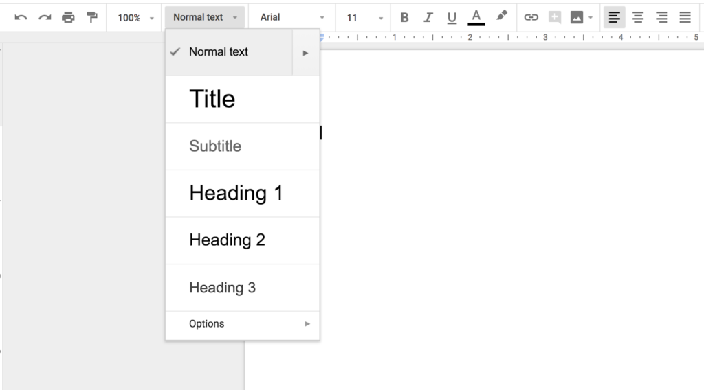

 ## Formatting text and paragraph
 
 Google Docs provides options for you to customize the appearance of your document.

 ---
 ### Basic text formatting
 To format selected text:
 - **Bold**: Click **B** in the toolbar or press `ctrl / ⌘+ B`
 - **Italic**: Click **I** in toolbar or press`ctrl / ⌘ + I`
 - **Underline**: Click **U** in toolbar or press `ctrl / ⌘ + U`

 Alternatively: 

 1. Click **Format** in the menu bar. 
 3. Select **Text** from the dropdown menu. 
 4. Choose **bold**, **italic**, or **Underline**. 

 

 ---
 ### Apply styles and headings
 1. Click **"Normal text"** in the toolbar
 2. Choose a style:
  - **Title** or **Subtitle**.
  - **Heading 1**, **Heading 2**.
  - **Normal text** to revert.

 

 ---
 ### Change Font style and size 
 1. Click the font name (for example, **"Arial"**) in the toolbar, then select a font
 2. Click the number next to the font name (usually 11) to change the font size

 

 ---
 ### Change text colour and highlight
 - Click the **A** icon in the toolbar to change text colour.

 

 - Click the highlighter icon on the right of the A icon to highlight text.

 

 ---
 ### Text alignment and indent
 #### Align text
 1. Click the three dot at the extreme right of the toolbar. 
 2. Select **align & indent**.
 2. Choose an alignment option.
  - **Left**: `Ctrl / ⌘ + Shift + L`
  - **Right**: `Ctrl / ⌘ + Shift + R`
  - **Centre**: `Ctrl / ⌘ + Shift + E`
  - **Justify**: `Ctrl / ⌘ + Shift + J`
  
 #### Indent Text
 - Click the three dots on the extreme right of the tool bar 
 - Select indent option 

 or,

 - Click format on menu bar 
 - Select **Align & Indent** 
 - Select to increase or decrease indent

 ! [Text alignment and indent options in Google Docs](images/align-and-indent-text.png)
 ---
 ### Adjust Line Spacing
 - Go to **Format** 
 - Click **Line and paragraph spacing**
 - Choose a spacing option 

 

 ---
 ### Create Bullet or Numbered Lists
 - Click the **bullet (.) icon** or **number (1) icon** on the toolbar
 - Select from the dropdown menu a different list style

 

 or, 

 - Click format in the menu bar
 - Select **Bullets & Numbering** 
 - Select from bullet or number list

 
 
 ---