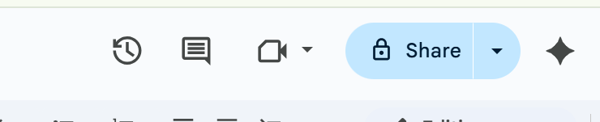

 ## Navigating the Google Docs interface
 Understanding the Google Docs interface is important in using its features effectively. This section describes key areas you will encounter when you create a document. 
 
 ---
 ### 1. Title bar

 Located at the top left, the title bar displays your document. By defaault, it appears as **Untitiled Document**. Click the title to rename your document. 
  

 ---
 ### 2. Menu bar
 The menu bar runs horizontally below the title bar. It contains options such as:
 - **File:** Create, open, save, download, and print document. 
 - **Edit:** Undo, redo, copy, paste.
 - **View:** Zoom, show rulers, or outline.
 - **Insert:** Add image, table, links, charts.
 - **Format:** Text style, alignment, line spacing.
 - **Tools:** Spell check, word count, voice typing.
 - **Extension:** Add-ons and integrations.
 - **Help:** Search and support options.

  

 ---
 ### 3. Toolbar
  
 Located below the menu bar, the toolbar provides quick access to commonly used functions such as:
 - Undo and Redo.
 - Print.
 - Font and Size.
 - Bold, Italic, and Underline.
 - Insert link, Image, and Comment.
 - Text alignment options.
 
  

 ---
 ### Working area
 
 This area is where you type and edit your document.
  
  
 ---
 ### Collaboration controls

 On the top right corner, you will find collaboration tools. These include the **Share**, the **Comments**, the **Last edit**, and the **Join a call** options.
 
 
 
 ---
 ### Comment and suggestion panel

 On the right margin you will see icons for comments, chats, and version history when collaborating.

 ---