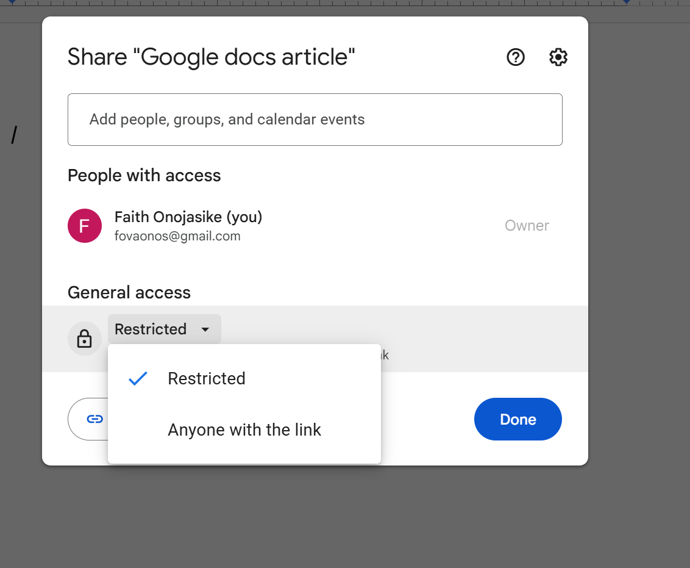
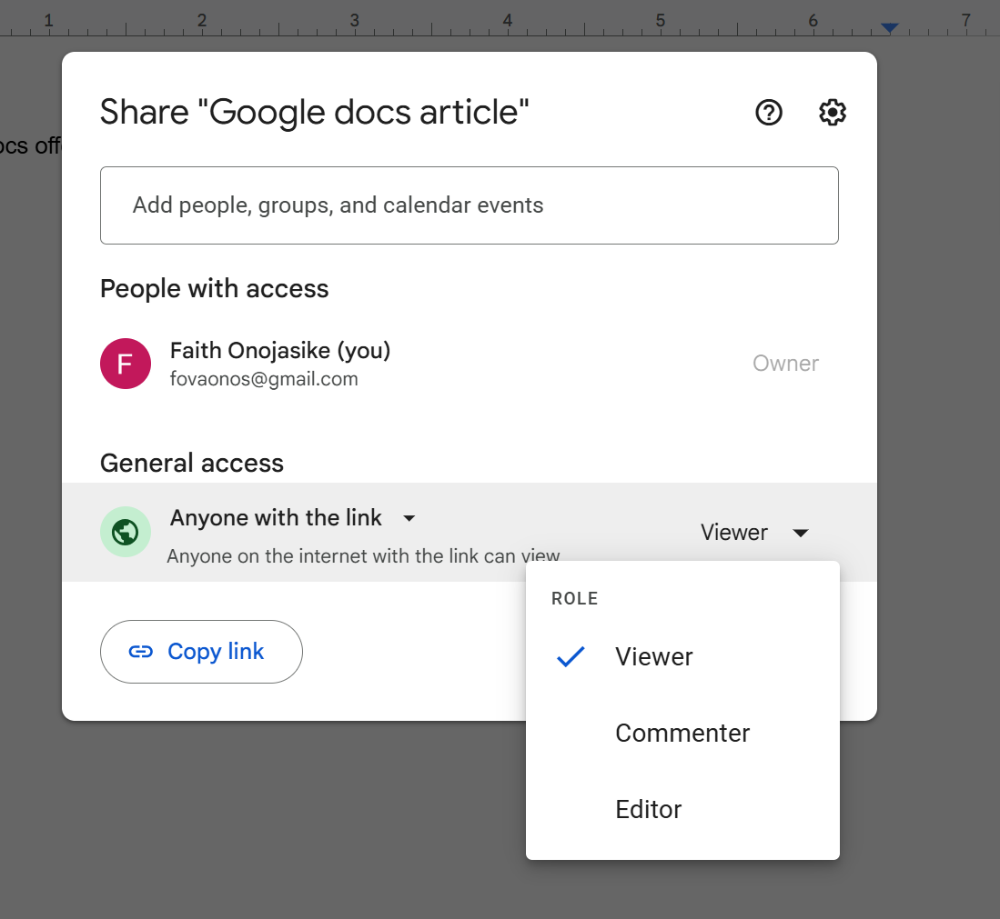
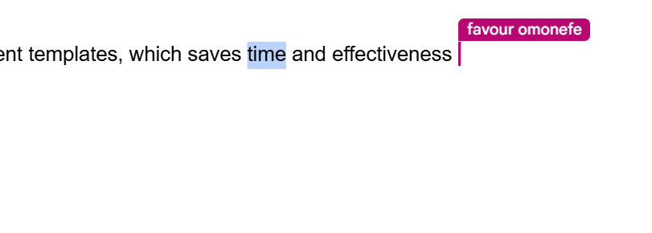
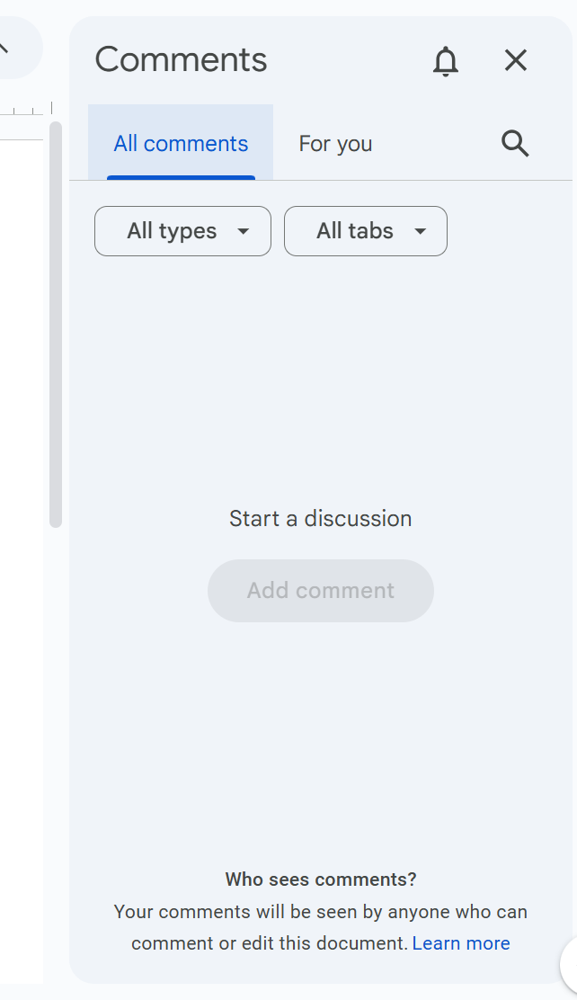
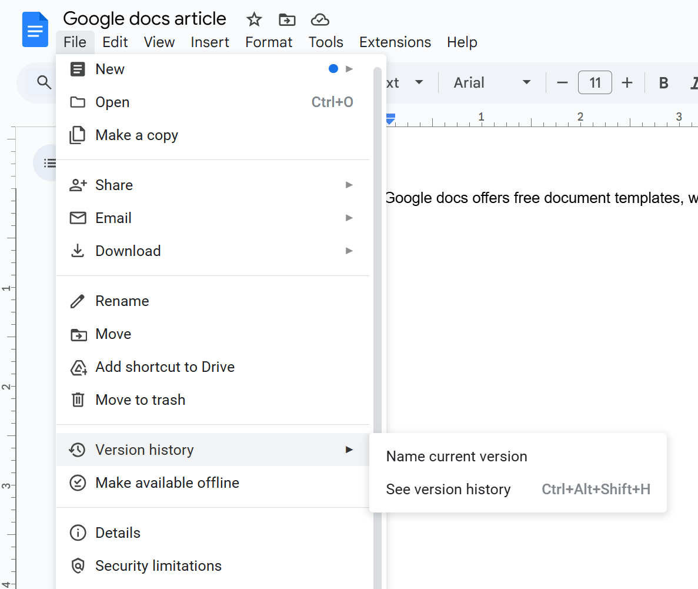
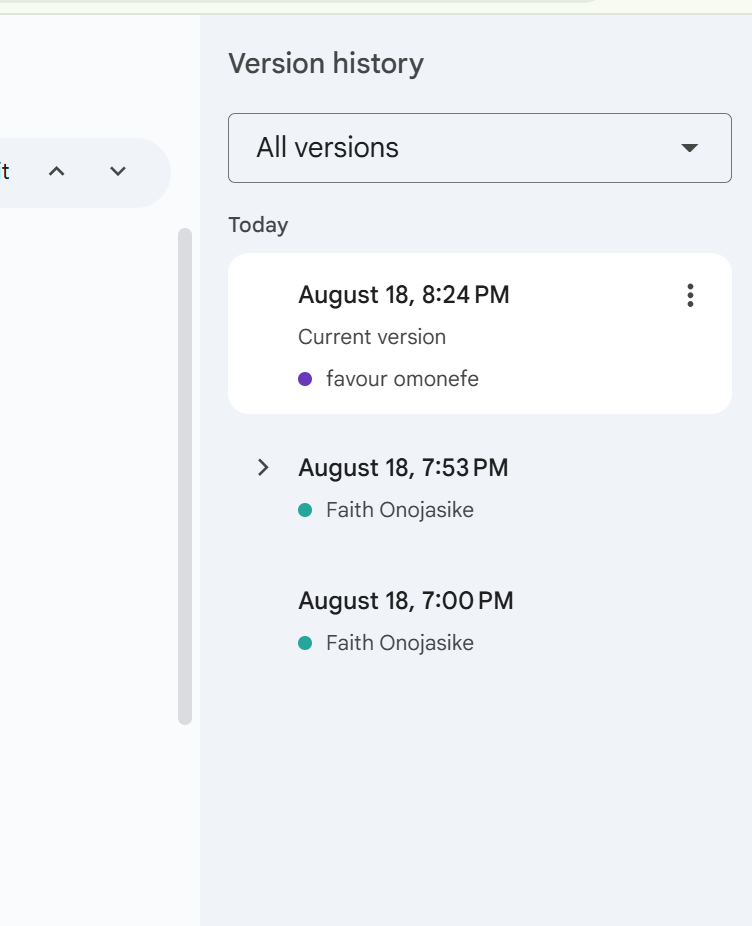

 ## Sharing and collaborating

 One of the most powerful features of Google Docs is real-time collaboration. Share your documents with others, set permission and work together simultaneously from any location. This feature makes it easy for  teams, classmates, or editors to work on a document without needing to email multiple document versions.

 ---

 ### Share a document

 1. Open the Google Docs file you want to share.
 2. Click the **Share** button at the top-right.
 3. In the pop-up window, you can:
   - **Add people, groups** by entering their email address, or
   - Click **copy link**.
 
 

 ---
 ### Setting permissions

 When sharing you control what others can do. The three options are:
 - **View**: Can only read the document.
 - **Comment**: Can comment or add suggestions.
 - **Edit**: Can make changes to the document.

 For the option of **copy link**, you also get to select what happens for anyone with the link to your documentation.

 

 ---
 ### Collaborating in real time
 When collaborators have access
 - You will see their **cursor and name** as they work.
 - Changes save automatically.
 - Highlight text and click the **comment icon** to leave comments.

 
 ---

 ### Using comment and suggestions

 - Highlight text → Click the **Comment** icon → type your message.
 - Turn on **Suggestion mode** from the top right tool bar.
  - Type in what you want changed in suggestion.
  - The document owner will accept or reject.

 

 ---

 ### Version history
 Google Docs keeps track of all changes:
 1. Go to **File**.
 2. Click **Version history** → **See version history**.

 

 You can see who made changes or restore an earlier version.

 

 ----