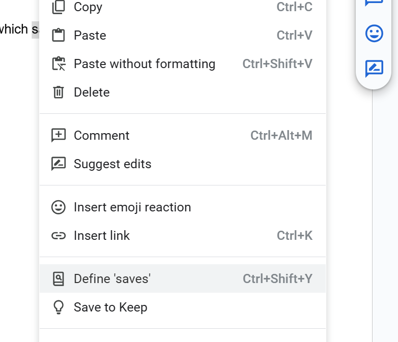
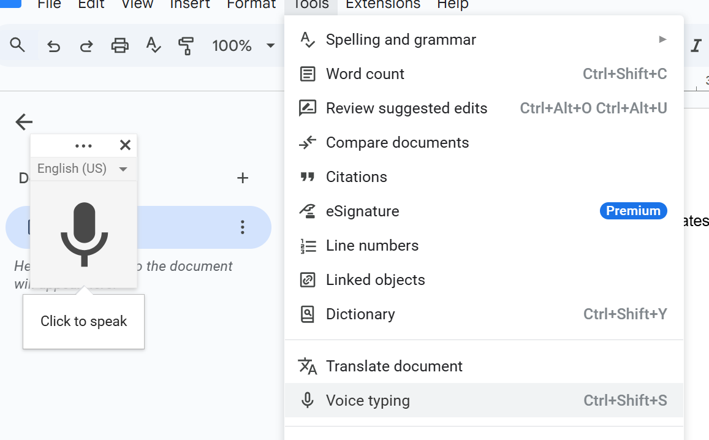
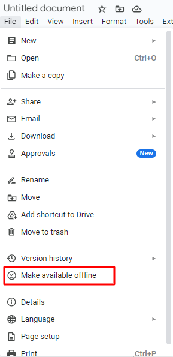
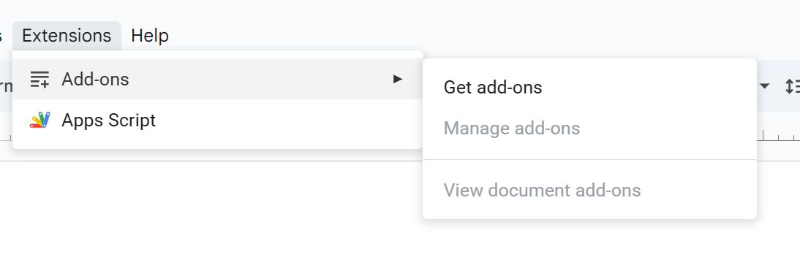
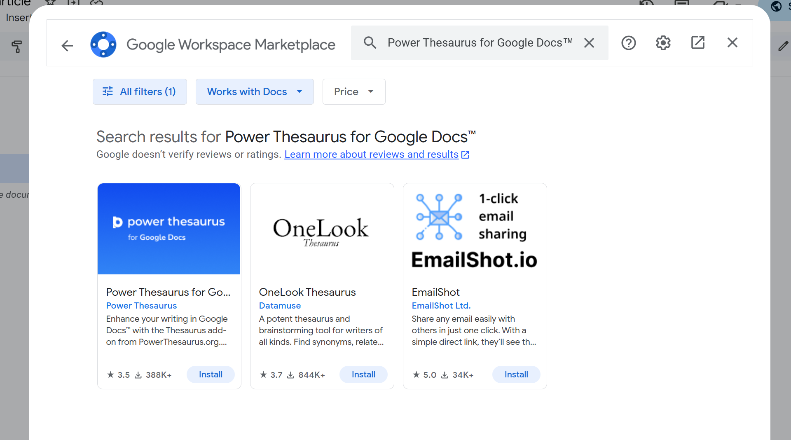

 ## Tips and tricks for beginners

 Google Docs has extra tools and features that optimize your document creation experience. Here are some helpful tips in getting started.

 ---
 ### Use templates
 Google Docs offers free document templates which saves time and gives you a head start. Go to **Template gallery** from the home page to choose from ready-made templates.
 
 ---
 ### Use the built-in dictionary
 - Highlight the word. 
 - Right-click and select **Define**.

 
 
 ---
 ### Voice typing 
 Use your voice to type and edit text in Google Docs. This is a feature that saves time, especially when working on long documents. 

 To enable and use voice typing do the following:
 1. Click Tools and Select voice typing.
 2. Grant microphone access.
 3. Click the microphone icon to start speaking.
 4. Move your cursor to any part of the document to make corrections without turning off the microphone.

 

 >Tips: You can dictate punctuations such as periods, comma and exclamation marks.
 ---
 ### Keyboard shortcuts

 |Actions                                    | Windows/ Linux                | Mac                            |
 |-------------------------------------------|-------------------------------|--------------------------------|
 | **Create and manage documents**           |                               |                                |
 | Create new document (in Google Drive tab) | `Ctrl + Shift + T`            | `Command + Shift + T`          |
 | Open a document                           | `Ctrl + O`                    | `Command + O`                  |
 | Save document                             | `Ctrl + S`                    | `Command + S`                  |
 | **Text formatting and styling**           |                               |                                |
 | Underline text                            | `Ctrl + U`                    | `Commant + U`                  |
 | Bold text                                 | `Ctl + B`                     | `Command + B`                  |
 | Italize text                              | `Ctrl + I`                    | `Command + I`                  |
 | Strikethrough text                        | `Alt + Shift + 5`             | `Command + Shift + X`          |
 | Increase font size                        | `Ctrl + Shift + >`            | `Command + Shift + >`          |
 | Apply heading (1 for heading 1)           | `Ctrl + Shift + 1`            | `Command + Shift + !`          |
 | **Editing**                               |                               |                                |
 | Copy                                      | `Ctrl + C`                    | `Command + C`                  |
 | Cut                                       | `Ctrl + X`                    | `Command + X`                  |
 | Paste                                     | `Ctrl + V`                    | `Command + V`                  |
 | Undo                                      | `Ctrl + Z`                    | `Command + Z`                  |
 | Redo                                      | `Ctrl + Y`                    | `Command + Y`                  |
 | **Selection and alignment**               |                               |                                |
 | Select all                                | `Ctrl + A`                    | `Command + A`                  |
 | Center text                               | `Ctrl + Shift + E`            | `Command + Shift + E`          |
 | Left Align                                | `Ctrl + Shift + L`            | `Command + Shift + L`          |
 | Right align                               | `Ctrl + Shift + R`            | `Command + Shift + R`          |
 | Justify text                              | `Ctrl + J`                    | `Command + J`                  |
 | **Inserting and collaboration**           |                               |                                |
 | Insert link                               | `Ctrl + K`                    | `Command + K`                  |
 | Add comments                              | `Ctrl + Alt + M`              | `Command + Option + M`         |
 | **Tools & Document Info                   |                               |                                |
 | Show version history                      | `Ctrl + Alt + Shift + H`      | `Commant + Option + Shit+ H`   |
 | Check word count                          | `Ctrl + Shift + C`            | `Command + Shift + C`          |
 | Open dictionary                           | `Ctrl + Shift + y`            | `Command + Shift + y`          |
 | **Help and shortcuts**                    |                             |                                |
 | Display list of Google docs shortcuts     | `Ctrl + /`                    | `Command + /`                  |

 ---
 ### Access documents offline
 Edit documents without internet access. 
 Use these steps to make your document avialable offline:
 1. Click on **"file"** in the menu bar.
 2. Select **"Make avialable offline"**.

 

 ---
 ### Using add-ons

 Add-ons are third-party tools that integrates directly into Google Docs which improves productivity and workflow. 
 Follow these steps to install and use add-ons:
 1. Click Extentions > Add-ons > Get Add-ons
 2. Search for the Add-on you want.
 3. Click **Install** and follow the on-screen prompt

 

 Example of useful Add-on
 - **Power Thesaurus**: For synonyms and antonyms.
 - **EasyBib Bibliography Creator**: Create Citation in various formats.
 
 
 
 ---

    
